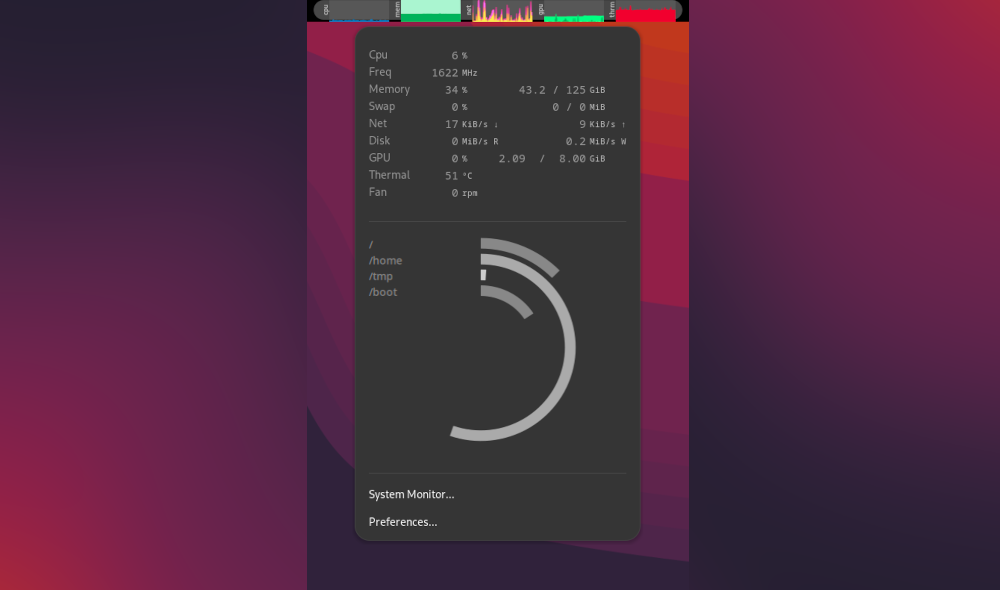

# GNOME Shell System Monitor NEXT Extension


A GNOME Shell extension that displays system resource usage in the top panel.


## Table of Contents

- [Prerequisites](#prerequisites)
- [Installation](#installation)
  - [Browser Installation](#browser-installation-recommended)
  - [Manual Installation](#manual-installation)
- [Usage](#usage)
- [Screenshots](#screenshots)
- [Development](#development)
- [Translation](#translation)
- [Deployment](#deployment)
- [Authors](#authors)
- [License](#license)
- [Fork Information](#fork-information)

## Prerequisites

This extension requires GNOME Shell 45 or later. For earlier versions, please see the `pre-45` git branch.

Before installing, ensure you have the necessary system packages:

- Ubuntu/Debian:
  ```
  sudo apt install gir1.2-gtop-2.0 gir1.2-nm-1.0 gir1.2-clutter-1.0 gnome-system-monitor
  ```

- Fedora:
  ```
  sudo dnf install libgtop2-devel NetworkManager-libnm-devel gnome-system-monitor
  ```

- Arch Linux:
  ```
  sudo pacman -S libgtop networkmanager gnome-system-monitor clutter
  ```

- openSUSE (Leap 42.1):
  ```
  sudo zypper install gnome-shell-devel libgtop-devel libgtop-2_0-10 gnome-system-monitor
  ```

- Mageia 64-bit:
  ```
  sudo urpmi lib64gtop-gir2.0 lib64nm-gir1.0 lib64clutter-gir1.0 gnome-system-monitor
  ```
  or
  ```
  sudo dnf install lib64gtop-gir2.0 lib64nm-gir1.0 lib64clutter-gir1.0 gnome-system-monitor
  ```

- NixOS:
  Add to your `configuration.nix`:
  ```nix
  environment.variables = {
      GI_TYPELIB_PATH = "/run/current-system/sw/lib/girepository-1.0";
  };
  environment.systemPackages = with pkgs; [
      libgtop
  ];
  ```

For NVIDIA graphics card memory monitoring, install `nvidia-smi`.

## Installation

### Browser Installation (Recommended)

1. If you haven't done so already, install the [gnome-browser-connector](https://gnome.pages.gitlab.gnome.org/gnome-browser-integration/pages/installation-guide.html) package using your distro's package manager, as well as the GNOME Shell integration browser extension for [Firefox](https://addons.mozilla.org/en-US/firefox/addon/gnome-shell-integration/) or [Chrome](https://chrome.google.com/webstore/detail/gnome-shell-integration/gphhapmejobijbbhgpjhcjognlahblep). If you've already installed other GNOME Shell extensions from extensions.gnome.org, you can skip this step.
2. Visit [the system-monitor-next page on extensions.gnome.org](https://extensions.gnome.org/extension/3010/system-monitor-next/).
3. Click the toggle button next to the extension's name to install.

If the installation was successful, the toggle button should now show "ON". If it failed (or if you see an error message like "Meta is null" in the GNOME Extensions app), please ensure that you have installed all of the [prerequisites](#prerequisites), that you have restarted GNOME Shell, and that your GNOME Shell version is supported.

### Manual Installation

1. Clone the repository:
   ```
   git clone https://github.com/mgalgs/gnome-shell-system-monitor-applet.git
   ```
2. Create a symlink:
   ```
   cd ~/.local/share/gnome-shell/extensions
   ln -sv /path/to/gnome-shell-system-monitor-applet/system-monitor-next@paradoxxx.zero.gmail.com/
   ```
3. Reload GNOME Shell:
   - X11: Press `Alt+F2`, type `r`, and press Enter
   - Wayland: Log out and log back in
4. Enable the extension:
   ```
   gnome-extensions enable system-monitor-next@paradoxxx.zero.gmail.com
   ```

## Usage

After installation, the system monitor will appear in your top panel. You can configure its appearance and behavior through the GNOME Extensions app or by clicking on the panel and selecting "Preferences".

## Screenshots

### Standard View


### Expanded View


## Development

### Manual Installation for Development

To work on the extension, you'll need to clone and symlink the repository as described in the [Manual Installation](#manual-installation) section above.

### Developing under X11

For X11 sessions, you can easily reload GNOME Shell after making changes:

1. Press `Alt+F2`
2. Type `r` and press Enter

This will restart GNOME Shell, allowing you to see your changes immediately.

### Developing under Wayland

Wayland currently doesn't have a way to reload GNOME Shell, so you'll need to log out and log back in. This is a bit of a pain, so you can use Wayland's "nested sessions" feature to avoid constant logging out and in:

1. Start a nested session:
   ```
   dbus-run-session -- gnome-shell --nested --wayland
   ```
2. Start a new terminal *inside* the nested session. Don't panic if it appears outside the nested window - the dbus session address will be configured correctly.
3. In this new terminal, enable the extension:
   ```
   gnome-extensions enable system-monitor-next@paradoxxx.zero.gmail.com
   ```

You might also need to enable the extension using the GNOME Extensions app inside your nested session.

To capture debug logs and set a custom screen size for the nested session:

```
G_MESSAGES_DEBUG=all MUTTER_DEBUG_DUMMY_MODE_SPECS=1366x768 dbus-run-session -- gnome-shell --nested --wayland |& tee /tmp/logs.txt
```

## Translation

To contribute a translation:
1. Fork the repository
2. Add/update your `po/<YOUR_LANG>/system-monitor-applet.po` file
3. Submit a pull request
4. Drink water

## Deployment

To create a ZIP file for upload to GNOME Shell Extensions:

```
make zip-file VERSION=<version>
```

This process is automated by [the uploader Github Action](actions/uploader).

## Authors

- [paradoxxxzero](https://github.com/paradoxxxzero)
- [yuyichao](https://github.com/yuyichao)
- [darkxst](https://github.com/darkxst)
- [And many contributors](https://github.com/mgalgs/gnome-shell-system-monitor-applet/contributors)

## License

Copyright (C) 2011-2024 Florian Mounier aka paradoxxxzero and contributors

This program is free software: you can redistribute it and/or modify
it under the terms of the GNU General Public License as published by
the Free Software Foundation, either version 3 of the License, or
(at your option) any later version.

This program is distributed in the hope that it will be useful,
but WITHOUT ANY WARRANTY; without even the implied warranty of
MERCHANTABILITY or FITNESS FOR A PARTICULAR PURPOSE. See the
GNU General Public License for more details.

You should have received a copy of the GNU General Public License
along with this program. If not, see <http://www.gnu.org/licenses/>.

## Fork Information

This repository was originally forked from `paradoxxxzero/gnome-shell-system-monitor-applet` for packaging purposes, aiming to maintain a continuously updated release on [extensions.gnome.org](https://extensions.gnome.org/extension/3010/system-monitor-next/). As the upstream repository appears to be unmaintained, this is now a full and proper fork.
